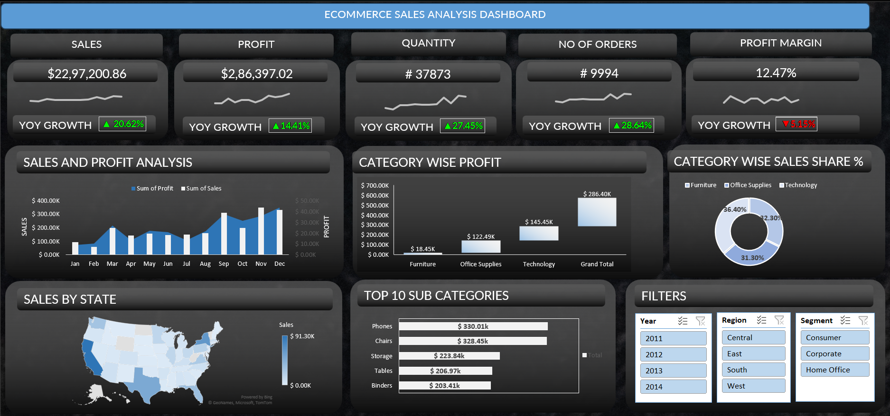

# 📊 Sales Performance Dashboard

Project Overview

This project analyzes sales data using Python and Jupyter Notebook. It provides meaningful insights through visualizations and dashboards to help understand business performance.

---

Features

- Sales Trend Analysis
- Profit Analysis
- Regional Sales Analysis
- Category-wise Performance
- Monthly Sales Trend
- Top Selling Products
- Interactive Charts

---

Technologies Used

- Python
- Pandas
- NumPy
- Matplotlib
- Seaborn
- Plotly
- Jupyter Notebook

---

Dataset

The dataset contains:

- Order Date
- Sales
- Profit
- Category
- Region
- Product Name
- Customer Details

---
## 📸 Dashboard Preview



Key Insights

- Identified top-performing products.
- Compared regional sales performance.
- Analyzed monthly sales trends.
- Evaluated profit across different categories.

---

 Project Structure

```
Sales-Performance-Dashboard/
│
├── Sales_Performance_Dashboard.ipynb
├── sales_data.csv
├── dashboard.png
├── requirements.txt
└── README.md
```

---

Author

Anu Tyagi
